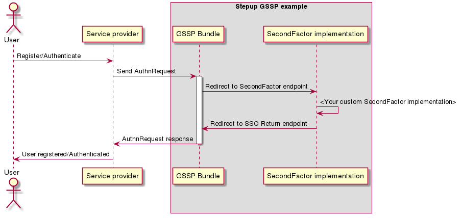

Stepup-gssp-example
===================

<a href="#">
    
</a></br>

Example Generic SAML Stepup Provider.

This repository can be used for reference material or 
as a base project setup for new IdP SecondFactor application.

The SAML logic for receiving authentication request (AuthnRequest) and sending authentication response back is
placed inside the Symfony bundle [stepup-gssp-bundle](https://github.com/OpenConext/Stepup-gssp-bundle). The state of the
application is stored inside PHP sessions, each new request will invalidate the current session state.

Locale user preference
----------------------

The default locale is based on the user agent. When the user switches its locale the selected preference is stored inside a
browser cookie (stepup_locale). The cookie is set on naked domain of the requested domain (for tiqr.example.com this is example.com).

Authentication and registration flows
-------------------------------------

The application provides internal (SpBundle) and a remote service provider. Instructions for this are given 
on the homepage of this example project [Homepage](https://tiqr.example.com/app_dev.php/).


<!---
regenerate docs/flow.png with `plantum1 README.md` or with http://www.plantuml.com/plantuml
@startuml docs/flow
actor User
participant "Service provider" as SP
box "Stepup GSSP example"
participant "GSSP Bundle" as IdP
participant "SecondFactor implementation" as App
end box
User -> SP: Register/Authenticate
SP -> IdP: Send AuthnRequest
activate IdP
IdP -> App: Redirect to SecondFactor endpoint
App -> App: <Your custom SecondFactor implementation>
App -> IdP: Redirect to SSO Return endpoint
IdP -> SP: AuthnRequest response
deactivate IdP
SP -> User: User registered/Authenticated
@enduml
--->


How to create your own Stepup Provider
======================================

There are two ways to approach this. 

Copy this GSSP example repository
---------------------------------

One of the benefits of using this repository is that it contains many pre-configured tools:

* Metrics & test tooling [testing.md](./docs/testing.md)
* Development environment provisioned by Vagrant 
* Pre-configured travis.yml for CI integration
* Default SurfContext styling [frontend_tooling.md](./docs/frontend_tooling.md)

1) Clone and checkout this repository
2) Change the project configuration variables:
    * composer.json name and description
    * this readme.md file
    * Replace 'tiqr.example.com' in all files with your own hostename
3) Install the copied project. (See [Development environment](#) section of this README.md file)
4) Implement your authentication & registration logic in DefaultController::registrationAction and DefaultController::authenticateAction. 
5) Feel free to rename and change this example clone for your needs.

Install from a clean or exiting symfony project
------------------------------------

1) [Install Symfony](http://symfony.com/doc/current/setup.html) 
2) Follow the instructions from the [GSSP bundle](https://github.com/OpenConext/Stepup-gssp-bundle)

Development environment
======================

To get started, first setup the development environment. The dev env is a virtual machine. Every task described here is required to run
from that machine.  

Requirements
-------------------
- ansible 2.x
- vagrant 1.9.x
- vagrant-hostsupdater
- Virtualbox
- ansible-galaxy

Install
=======

``` ansible-galaxy install -r ansible/requirements.yml -p ansible/roles/ ```

``` vagrant up ```

Go to the directory inside the VM:

``` vagrant ssh ```

``` cd /vagrant ```

Install composer dependencies:

``` composer install ```

Build frond-end assets:

``` composer encore dev ``` or ``` composer encore prod ``` for production 

If everything goes as planned you can go to:

[https://tiqr.example.com](https://tiqr.example.com)

Debugging
---------

Xdebug is configured when provisioning your development Vagrant box. 
It's configured with auto connect IDE_KEY=phpstorm.

Tests and metrics
======================

To run all required test you can run the following commands from the dev env:

```bash 
    composer test 
```

Every part can be run separately. Check "scripts" section of the composer.json file for the different options.

Release instructions example project
====================================

The projects follow semantic versioning. To create a new release perform the following steps:

1. Merge feature branch in development branch.

2. Merge development branch in master branch.

3. Checkout and update (pull) master branch

4. Create version with RMT

```bash 
    ./RMT release
```

5. Release the new version on Github [Releases](https://github.com/OpenConext/Stepup-gssp-example/releases)

Other resources
======================

 - [Developer documentation](docs/index.md)
 - [Issue tracker](https://www.pivotaltracker.com/n/projects/1163646)
 - [License](LICENSE)
