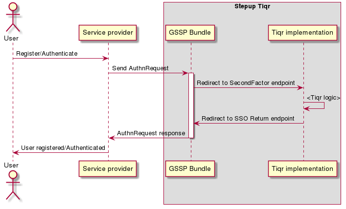

Stepup-tiqr
===========

<a href="#">
    
</a></br>

GSSP implementation of Tiqr. [https://tiqr.org/documentation/](https://tiqr.org/documentation/)

Project is based on example GSSP project [https://github.com/OpenConext/Stepup-gssp-example]()

Locale user preference
----------------------

The default locale is based on the user agent. When the user switches its locale the selected preference is stored inside a
browser cookie (stepup_locale). The cookie is set on naked domain of the requested domain (for tiqr.example.com this is example.com).

Authentication and registration flows
-------------------------------------

The application provides internal (SpBundle) and a remote service provider. Instructions for this are given 
on the homepage of this Tiqr project [Homepage](https://tiqr.example.com/app_dev.php/).


<!---
regenerate docs/flow.png with `plantum1 README.md` or with http://www.plantuml.com/plantuml
@startuml docs/flow
actor User
participant "Service provider" as SP
box "Stepup Tiqr"
participant "GSSP Bundle" as IdP
participant "Tiqr implementation" as TiqrSF
end box
User -> SP: Register/Authenticate
SP -> IdP: Send AuthnRequest
activate IdP
IdP -> TiqrSF: Redirect to SecondFactor endpoint
TiqrSF -> TiqrSF: <Tiqr logic>
TiqrSF -> IdP: Redirect to SSO Return endpoint
IdP -> SP: AuthnRequest response
deactivate IdP
SP -> User: User registered/Authenticated
@enduml
--->

Tiqr registration
-----------------


<!---
regenerate docs/tiqr_registration.png with `plantum1 README.md` or with http://www.plantuml.com/plantuml
@startuml docs/tiqr_registration
actor User
participant "Website" as Site
participant "App" as App
participant "Api" as Api
activate Site
Site -> User: Show QR code
App -> Site: Scan the registration code
deactivate Site
activate App
App -> Api: Request the metadata endpoint 
App -> User: Asks for verification code
App -> Api: Registers user with secret and OTP
deactivate App
activate Site
Site -> Api: Asks the Api if the user is registered
Site -> User: Registration done
deactivate Site
@enduml
--->

Development environment
======================

To get started, first setup the development environment. The dev env is a virtual machine. Every task described here is required to run
from that machine.  

Requirements
-------------------
- ansible 2.x
- vagrant 1.9.x
- vagrant-hostsupdater
- Virtualbox
- ansible-galaxy

Install
=======

``` ansible-galaxy install -r ansible/requirements.yml -p ansible/roles/ ```

``` vagrant up ```

Go to the directory inside the VM:

``` vagrant ssh ```

``` cd /vagrant ```

Install composer dependencies:

``` composer install ```

Build frond-end assets:

``` composer encore dev ``` or ``` composer encore production ``` for production 

If everything goes as planned you can go to:

[https://tiqr.example.com](https://tiqr.example.com)

Debugging
---------

Xdebug is configured when provisioning your development Vagrant box. 
It's configured with auto connect IDE_KEY=phpstorm.

Demo sp is available on  [https://tiqr.example.com/app_dev.php/demo/sp]()

Tests and metrics
======================

To run all required test you can run the following commands from the dev env:

```bash 
    composer test 
```

Every part can be run separately. Check "scripts" section of the composer.json file for the different options.

Test Tiqr Api's
---------------

Demo sp is available on  [https://tiqr.example.com/app_dev.php/demo/sp]()

Fetch registration link automatically from /app_dev.php/registration/qr/dev

``` ./bin/console test:registration```

``` ./bin/console test:registration <registration url>``` 

``` ./bin/console test:registration <./<qr_file.png>```  

``` ./bin/console test:authentication```

``` ./bin/console test:authentication <authentication url>``` 

``` ./bin/console test:authentication <./<qr_file.png>```  

Release instructions project
============================

The projects follow semantic versioning. To create a new release perform the following steps:

1. Merge feature branch in development branch.

2. Merge development branch in master branch.

3. Checkout and update (pull) master branch

4. Create version with RMT

```bash 
    ./RMT release
```

5. Release the new version on Github [Releases](https://github.com/OpenConext/Stepup-gssp-example/releases)

Other resources
======================

 - [Developer documentation](docs/index.md)
 - [Issue tracker](https://www.pivotaltracker.com/n/projects/1163646)
 - [License](LICENSE)
 - [Tiqr library](https://github.com/SURFnet/tiqr-server-libphp)
 - [Library documentation](https://tiqr.org/documentation/) 
 - [Tiqr config parameters](https://github.com/SURFnet/simplesamlphp-module-authtiqr)
